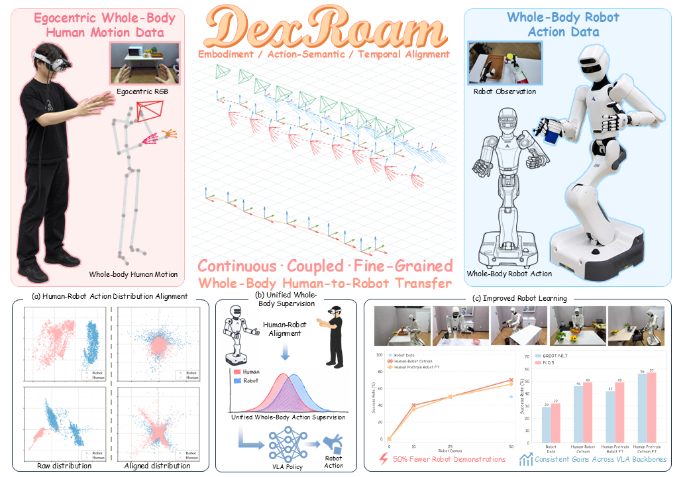

<div align="center">


# DexRoam: Learning Mobile Bimanual Dexterous Manipulation from Egocentric Whole-Body Human Demonstrations

[](https://dexroam.github.io/) [](https://arxiv.org/abs/2609.35761) [](https://github.com/zhourui9813/DexRoam) [](https://docs.google.com/document/d/1fHvN4iPmd4ubBjKe_wXvZgA8-xidLD2B3mQOxtPLVF0/edit?tab=t.0) [](https://huggingface.co/datasets/zhourui9813/DexRoam_Realworld_Data)

[**Rui Zhou**](https://zhourui9813.github.io/)<sup>1,2,\*</sup>,
[**Yibo Yuan**](https://xiaoxiaoabo.github.io/)<sup>4,2,\*</sup>,
[**Junkai Zhao**](https://openreview.net/profile?id=~Junkai_Zhao1)<sup>2,\*,†</sup>,
[**Fangyuan Zhao**](https://scholar.google.com.hk/citations?hl=zh-CN&user=opKtK9oAAAAJ)<sup>3</sup>,
[**Xiaoguang Zhao**](https://openreview.net/profile?id=~Xiaoguang_Zhao1)<sup>5</sup>,
[**Shanghang Zhang**](https://scholar.google.com/citations?user=voqw10cAAAAJ)<sup>3,✉</sup>,
[**Sirui Han**](https://siruihan2024.github.io/)<sup>1,✉</sup>

<sup>1</sup>The Hong Kong University of Science and Technology &nbsp;
<sup>2</sup>Beijing Academy of Artificial Intelligence<br>
<sup>3</sup>State Key Laboratory of Multimedia Information Processing, School of Computer Science, Peking University<br>
<sup>4</sup>Beihang University &nbsp;
<sup>5</sup>Institute of Automation, Chinese Academy of Sciences


</div>

---

This repository contains the VLA training code for [DexRoam: Learning Mobile Bimanual Dexterous Manipulation from Egocentric Whole-Body Human Demonstrations](https://dexroam.github.io/), built on the [OpenPI π0.5](https://github.com/Physical-Intelligence/openpi) codebase from [Physical Intelligence](https://www.physicalintelligence.company/) and the [Isaac GR00T N1.7](https://github.com/NVIDIA/Isaac-GR00T) codebase from [NVIDIA](https://developer.nvidia.com/isaac/gr00t).



For the human motion capture and human-to-robot alignment stages, please refer to the [main DexRoam repository](https://github.com/zhourui9813/DexRoam).


## 📋 Table of Contents

- [Repository Structure](#-repository-structure)
- [Data Preparation](#-data-preparation)
- [Data Format](#-data-format)
- [VLA Training](#-vla-training)
- [Acknowledgments](#-acknowledgments)
- [Citation](#-citation)

## 📁 Repository Structure

```text
DexRoam-Policy-Training/
├── assets/
│   └── media/dexroam_teaser.png           # Project overview
├── data_scripts/
│   ├── dexroam_hdf5_to_lerobot.py         # HDF5 → LeRobot v2.1 converter
│   └── visualize_robot_data_traj.py       # Open3D HDF5 trajectory viewer
├── docs/
│   ├── pi05_training.md                   # OpenPI π0.5 training guide
│   └── gr00t_training.md                  # NVIDIA GR00T N1.7 training guide
├── dexroam_pi05/                          # OpenPI π0.5, Python 3.11
└── dexroam_gr00t/                         # NVIDIA GR00T N1.7, Python 3.12
```

> [!TIP]
> **Documentation & Guides**
>
> - **[Data Conversion](./data_scripts/dexroam_hdf5_to_lerobot.py)**: Convert DexRoam HDF5 episodes into LeRobot v2.1.
> - **[Robot Trajectory Viewer](./data_scripts/visualize_robot_data_traj.py)**: Inspect robot episodes with Open3D.
> - **[OpenPI π0.5 Training Guide](./docs/pi05_training.md)**: Environment setup, configuration, and training.
> - **[NVIDIA GR00T N1.7 Training Guide](./docs/gr00t_training.md)**: Model preparation, environment setup, and fine-tuning.

## 📦 Data Preparation

### 1. Download the Real-World Dataset

We provide a sample real-world dataset at
[`zhourui9813/DexRoam_Realworld_Data`](https://huggingface.co/datasets/zhourui9813/DexRoam_Realworld_Data).
It currently contains 50 HDF5 episodes for the task **Push the chair back under the desk and close the laptop**.

Install the required packages and download the dataset:

```bash
pip install numpy pandas pyarrow h5py tqdm "huggingface_hub[cli]" socksio

mkdir -p data_raw/
hf download zhourui9813/DexRoam_Realworld_Data \
  --repo-type dataset \
  --local-dir data_raw/
```

The downloaded episodes are located at:

```text
data_raw/Astribot-Xhand-data/robot_push_chair_and_close_laptop/
├── push_chair_and_close_laptop_episode_0.hdf5
├── ...
└── push_chair_and_close_laptop_episode_49.hdf5
```

### 2. Convert HDF5 to LeRobot

> [!NOTE]
> The converter also requires `ffmpeg` with `libx264` support.

Convert the HDF5 episodes to a LeRobot v2.1 dataset:

```bash
python data_scripts/dexroam_hdf5_to_lerobot.py \
  --input-dir data_raw/Astribot-Xhand-data/robot_push_chair_and_close_laptop/ \
  --recursive \
  --include-h5 \
  --output-root data_lerobot/Astribot-Xhand-data/robot_push_chair_and_close_laptop/ \
  --task "Push the chair back under the desk and close the laptop." \
  --fps 30
```

All episodes processed in the same run are assigned the same task description. The converted dataset has the following layout:

```text
data_lerobot/Astribot-Xhand-data/robot_push_chair_and_close_laptop/
├── data/chunk-000/*.parquet
├── videos/chunk-000/observation.images.head_stereo_left/*.mp4
├── videos/chunk-000/observation.images.head_stereo_right/*.mp4
└── meta/
    ├── info.json
    ├── modality.json
    ├── tasks.jsonl
    ├── episodes.jsonl
    ├── episodes_stats.jsonl
    └── stats.json
```

### 3. Visualize an HDF5 Episode (Optional)

Use the Open3D viewer to inspect a retargeted/resampled robot episode:

```bash
pip install numpy h5py scipy open3d

python data_scripts/visualize_robot_data_traj.py \
  --hdf5_path data_raw/Astribot-Xhand-data/robot_push_chair_and_close_laptop/push_chair_and_close_laptop_episode_0.hdf5
```

The viewer opens and starts playback automatically. By default, it integrates `/mobile_dict/relative_position`, reads robot poses from `/fk_poses_dict_from_state` in the base frame, and falls back to 30 FPS when `/time` is unavailable. Other layouts can be selected with `--mobile-position-source`, `--pose-group`, and `--pose-frame`.

The visualization includes:

- Mobile base, torso, head, and wrist coordinate frames, plus robot body connections
- Optional 25-keypoint human hands
- Head camera frame, frustum, and a dynamic image plane from `/images_dict/stereo_left/rgb`
- Ground grid, world origin, mobile-base start marker, and progressively revealed base and torso trajectories

Keyboard controls:

| Key     | Action                    |
| ------- | ------------------------- |
| `Space` | Play / pause              |
| `N`     | Next frame                |
| `P`     | Previous frame            |
| `R`     | Return to the first frame |

## 🧩 Data Format

The converter produces a LeRobot v2.1 dataset shared by both training pipelines.

| Field                                  | Description                                                  |
| -------------------------------------- | ------------------------------------------------------------ |
| `observation.images.head_stereo_left`  | Egocentric left stereo image                                 |
| `observation.images.head_stereo_right` | Egocentric right stereo image                                |
| `observation.state`                    | 53-D robot state: two 9-D arm poses, a 9-D torso pose, two 12-D dexterous hands, and a 2-D head state |
| `action`                               | 56-D whole-body action: two 12-D hands, two 9-D arm commands, a 9-D torso command, a 2-D head command, and a 3-D mobile-base displacement |
| `annotation.human.task_description`    | Integer index of the language task description               |

End-effector poses use `xyz + rot6d`. During conversion, quaternions are converted from `xyzw` to `rot6d`, joint angles from degrees to radians, and stereo observations are encoded as H.264 MP4 videos.

Each source HDF5 file must provide at least:

```text
/fk_poses_dict_from_state/{astribot_arm_left,astribot_arm_right,astribot_torso}
/fk_poses_relative_action/{astribot_arm_left,astribot_arm_right,astribot_torso}
/dex_hand_dict/{left,right}/state
/joints_dict/joints_position_command
/mobile_dict/relative_position
/images_dict/stereo_left/rgb
/images_dict/stereo_right/rgb
/time
```

## 🚀 VLA Training

DexRoam supports two VLA backbones, each with its own environment and training guide:

- **OpenPI π0.5**: [`docs/pi05_training.md`](./docs/pi05_training.md)
- **NVIDIA GR00T N1.7**: [`docs/gr00t_training.md`](./docs/gr00t_training.md)

## 🙏 Acknowledgments

This repository builds on [OpenPI](https://github.com/Physical-Intelligence/openpi), [Isaac GR00T](https://github.com/NVIDIA/Isaac-GR00T), and [LeRobot](https://github.com/huggingface/lerobot). We thank their authors for releasing their code and models.

## 📄 Citation

If you find DexRoam helpful, please consider giving this repository a ⭐

```bibtex
@article{zhou2026dexroam,
  title={DexRoam: Learning Mobile Bimanual Dexterous Manipulation from Egocentric Whole-Body Human Demonstrations},
  author={Zhou, Rui and Yuan, Yibo and Zhao, Junkai and Zhao, Fangyuan and Zhao, Xiaoguang and Zhang, Shanghang and Han, Sirui},
  journal={arXiv preprint arXiv:2609.35761},
  year={2026}
}
```
